# Práctica 1.1. Posicionamiento de lenguajes de programación

## Objetivo de la práctica

Al finalizar esta práctica, serás capaz de:

- Comparar la popularidad de distintos lenguajes de programación utilizando Google Trends.
- Analizar la disponibilidad de libros técnicos en Amazon México para diferentes lenguajes de programación.
- Interpretar los resultados obtenidos y elaborar conclusiones sobre el posicionamiento actual de cada lenguaje.

---

# Objetivo visual

Durante esta práctica realizarás una investigación comparativa utilizando dos fuentes de información.

```text
                  Inicio
                     │
                     ▼
          Acceder a Google Trends
                     │
                     ▼
      Comparar Python, C#, Java, C y C++
                     │
                     ▼
        Registrar resultados obtenidos
                     │
                     ▼
          Acceder a Amazon México
                     │
                     ▼
      Buscar libros de cada lenguaje
                     │
                     ▼
      Comparar cantidad de resultados
                     │
                     ▼
      Analizar información obtenida
                     │
                     ▼
            Redactar conclusiones
```

---

## Duración aproximada

**7 minutos.**

---

# Tabla de ayuda

| Recurso | Valor |
|---------|-------|
| Google Trends | https://trends.google.com/trends/?geo=MX |
| Amazon México | https://www.amazon.com.mx |
| Región sugerida | México |
| Lenguajes a comparar | Python, C#, Java, C y C++ |

---

# Instrucciones

## Tarea 1. Analizar la popularidad de los lenguajes mediante Google Trends

### Paso 1. Abrir Google Trends

Abrir el navegador web de su preferencia e ingresar al siguiente sitio:

**https://trends.google.com/trends/?geo=MX**

Esperar a que cargue completamente la página.

> **Nota:** Si Google solicita seleccionar una región, elegir **Tu región**.


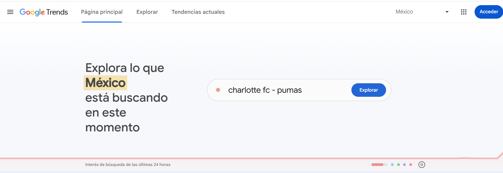


---

### Paso 2. Agregar el primer lenguaje de programación

En el cuadro de búsqueda escribir:

```
Python Lenguaje de programación
```

Presionar **Enter** para visualizar las tendencias de búsqueda.


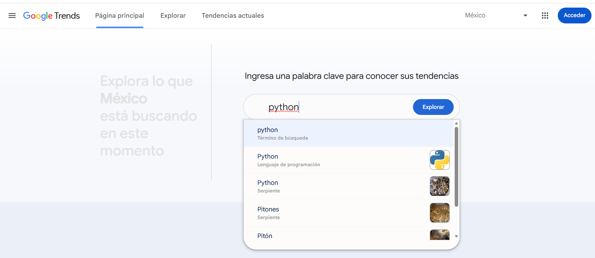

---

### Paso 3. Comparar los cinco lenguajes

Agregar como términos de comparación los siguientes lenguajes:

- Python
- C#
- Java
- C
- C++

Verificar que los cinco aparezcan en la gráfica comparativa.

> **Recomendación:** Mantener la región configurada en **Tu región** para obtener resultados consistentes.


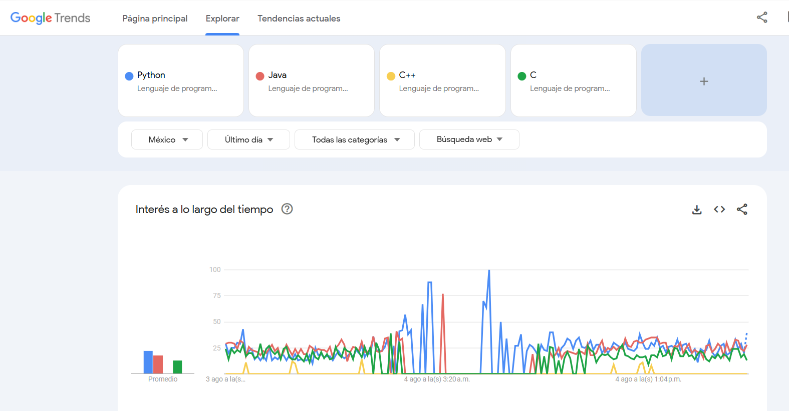


---

### Paso 4. Registrar las observaciones

Completar la siguiente tabla con los resultados observados.

| Lenguaje | Tendencia observada |
|----------|---------------------|
| Python | |
| C# | |
| Java | |
| C | |
| C++ | |

Responder las siguientes preguntas:

- ¿Qué lenguaje presenta mayor interés?
- ¿Cuál presenta menor interés?
- ¿Observa alguna tendencia relevante?

---

## Tarea 2. Comparar la disponibilidad de libros en Amazon México

### Paso 1. Abrir Amazon México

Ingresar al sitio:

**https://www.amazon.com.mx**

Esperar a que cargue completamente la página.

**Captura esperada**


---

### Paso 2. Buscar libros de Python

En el cuadro de búsqueda escribir:

```
Python
```

Registrar la cantidad aproximada de resultados obtenidos.

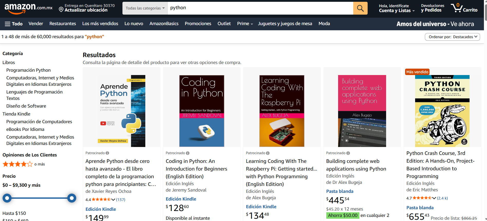

---

### Paso 3. Buscar los demás lenguajes

Realizar la misma búsqueda para:

- C#
- Java
- C
- C++

Registrar la cantidad aproximada de resultados.

Completar la siguiente tabla.

| Lenguaje | Cantidad aproximada de resultados |
|----------|-----------------------------------|
| Python | |
| C# | |
| Java | |
| C | |
| C++ | |

> **Nota:** La cantidad de resultados puede variar dependiendo de la fecha y la disponibilidad de productos.


---

## Tarea 3. Analizar los resultados

Con la información recopilada, responder las siguientes preguntas.

1. ¿Qué lenguaje presenta mayor interés en Google Trends?

2. ¿Cuál tiene mayor cantidad de libros disponibles en Amazon?

3. ¿Existe relación entre la popularidad del lenguaje y la cantidad de libros publicados?

4. ¿Qué lenguaje considera una buena opción para comenzar a aprender? Justifique su respuesta.

---

# Validación

Verifique que haya realizado correctamente cada una de las siguientes actividades.

| Validación | Completado |
|------------|------------|
| Accedió a Google Trends | ☐ |
| Comparó Python, C#, Java, C y C++ | ☐ |
| Registró sus observaciones | ☐ |
| Accedió a Amazon México | ☐ |
| Comparó la cantidad de libros disponibles | ☐ |
| Respondió las preguntas de análisis | ☐ |

---

# Resultado esperado

Al finalizar la práctica deberá contar con:

- Una comparación de tendencias de búsqueda de cinco lenguajes de programación.
- Una comparación de la cantidad aproximada de libros disponibles en Amazon para cada lenguaje.
- Un análisis personal sobre el posicionamiento y popularidad de los lenguajes evaluados.


---

# Conclusión

En esta práctica exploraste dos fuentes de información ampliamente utilizadas para analizar el posicionamiento de tecnologías: **Google Trends** y **Amazon México**. A partir de la comparación de tendencias y la disponibilidad de material bibliográfico, pudiste identificar el nivel de interés y adopción de distintos lenguajes de programación.

Es importante recordar que la popularidad de un lenguaje puede cambiar con el tiempo debido a las necesidades del mercado, la aparición de nuevas tecnologías y la evolución de la industria del software.

---

# Conocimientos adquiridos

Al concluir esta práctica aprendiste a:

- Utilizar Google Trends para comparar tecnologías.
- Interpretar tendencias de búsqueda en Internet.
- Investigar la disponibilidad de recursos técnicos en Amazon.
- Comparar información proveniente de distintas fuentes.
- Analizar el posicionamiento actual de diferentes lenguajes de programación.

---

# Práctica 1.2. Hola Mundo con Python Script

## Objetivo de la práctica

Al finalizar esta práctica, serás capaz de:

- Crear un directorio de trabajo para proyectos en Python.
- Crear y ejecutar tu primer script en Python utilizando Visual Studio Code.
- Comprender el funcionamiento básico de la función `print()` y la ejecución de un programa en Python.

---

# Objetivo visual

Durante esta práctica crearás tu primer programa en Python desde cero.

```text
             Abrir Terminal
                    │
                    ▼
        Crear directorio de trabajo
                    │
                    ▼
      Abrir Visual Studio Code
                    │
                    ▼
      Crear archivo p1_2.py
                    │
                    ▼
         Escribir código Python
                    │
                    ▼
         Ejecutar el programa
                    │
                    ▼
          Visualizar la salida
                    │
                    ▼
      Analizar el comportamiento
```

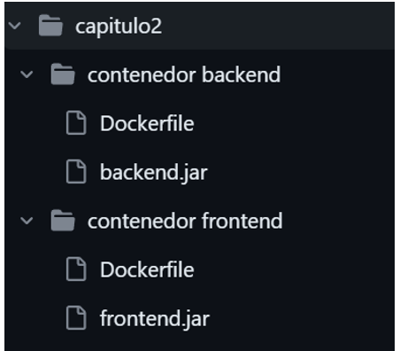

---

## Duración aproximada

**7 minutos**

---

# Tabla de ayuda

| Recurso | Valor |
|---------|-------|
| Editor | Visual Studio Code |
| Lenguaje | Python 3 |
| Archivo | `p1_2.py` |
| Carpeta de trabajo | `wp_essentials` |
| Comando para ejecutar | `python p1_2.py` |

---

# Instrucciones

## Tarea 1. Crear el espacio de trabajo

### Paso 1. Abrir una terminal

Abrir una ventana de **Símbolo del sistema (CMD)**, **PowerShell** o una terminal del sistema operativo.


---

### Paso 2. Crear el directorio de trabajo

Ejecutar el siguiente comando:

```bash
mkdir wp_essentials
```

Este comando crea una nueva carpeta donde se almacenarán los programas desarrollados durante el curso.

> **Nota:** Si la carpeta ya existe, el sistema mostrará un mensaje indicando que el directorio ya fue creado.

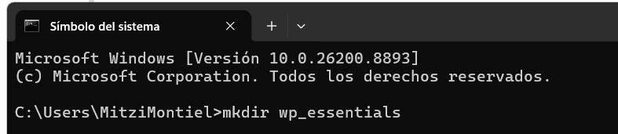


---

### Paso 3. Acceder al directorio

Ejecutar:

```bash
cd wp_essentials
```

Verificar que la terminal indique que ahora se encuentra dentro del directorio.

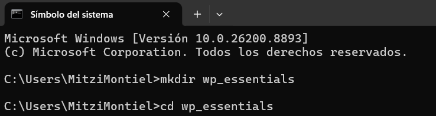

---

### Paso 4. Abrir Visual Studio Code

Ejecutar el siguiente comando:

```bash
code .
```
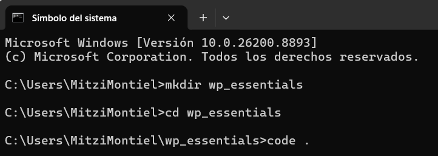

Visual Studio Code deberá abrir la carpeta de trabajo.

> **Importante:** Si el comando `code` no es reconocido, consulte al instructor para habilitar el comando desde Visual Studio Code.

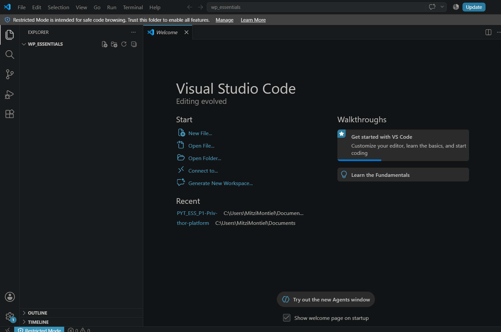

---

## Tarea 2. Crear el primer programa

### Paso 1. Crear un nuevo archivo

Crear un archivo llamado:

```text
p1_2.py
```

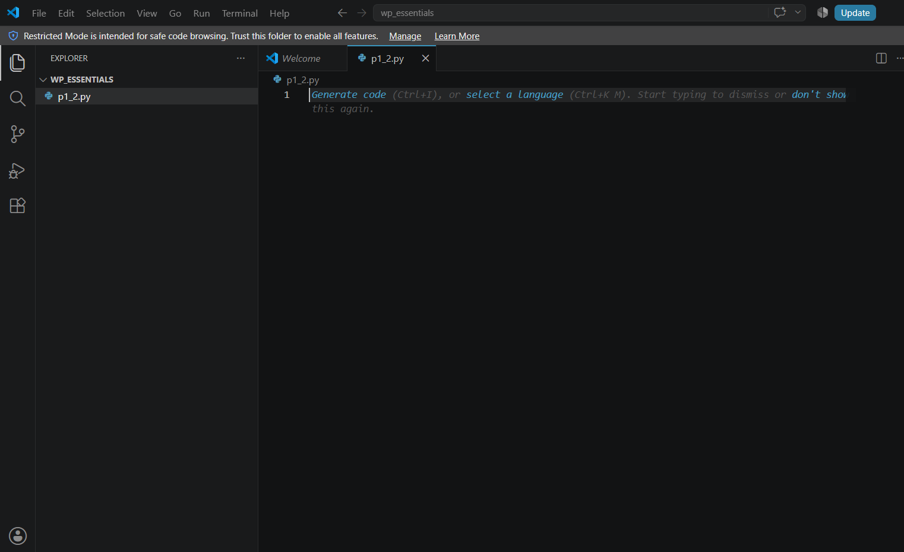

---

### Paso 2. Escribir el código

Agregar el siguiente código.

```python
print("¡Hola Mundo!")
```

Guardar el archivo.

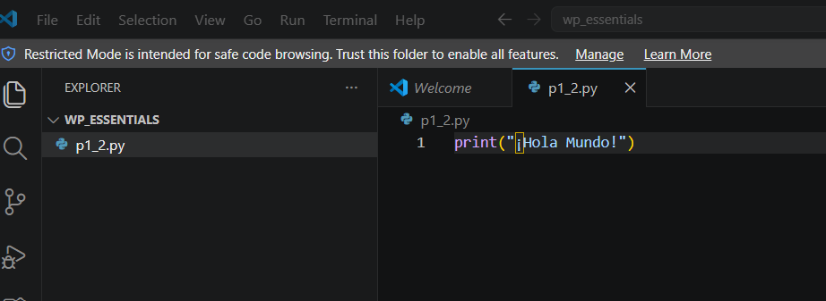


---

### Paso 3. Ejecutar el programa

Puede ejecutar el programa utilizando cualquiera de las siguientes opciones.

**Opción 1**

Seleccionar el botón **Run Python File** ubicado en la esquina superior derecha.

**Opción 2**

Abrir una terminal integrada (**Terminal > New Terminal**) y ejecutar:

```bash
python p1_2.py
```

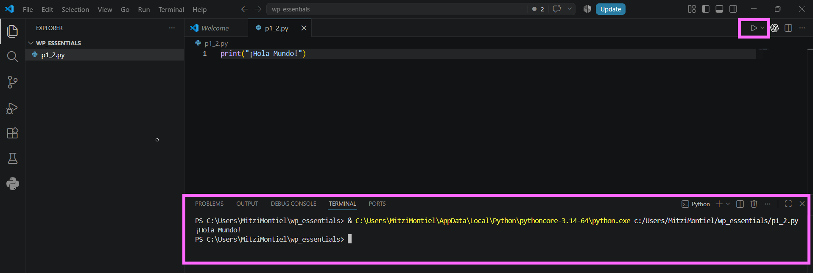

---

### Paso 4. Analizar la salida

Responder las siguientes preguntas.

- ¿Qué hace la función `print()`?
- ¿Qué sucede cuando modifica el texto entre comillas?
- ¿Qué ocurre si elimina una comilla?

---

### Paso 5. Observar los archivos generados

Revisar el Explorador de Visual Studio Code.

Responder:

- ¿Se generó un archivo ejecutable?
- ¿Por qué Python se considera un lenguaje interpretado?

---

# Validación

Verifique que realizó correctamente las siguientes actividades.

| Actividad | Completado |
|------------|------------|
| Creó la carpeta `wp_essentials` | ☐ |
| Abrió Visual Studio Code | ☐ |
| Creó el archivo `p1_2.py` | ☐ |
| Escribió el programa Hola Mundo | ☐ |
| Ejecutó correctamente el programa | ☐ |
| Analizó el funcionamiento de `print()` | ☐ |

---

# Resultado esperado

Al finalizar el laboratorio deberá visualizar una salida similar a la siguiente.

```text
¡Hola Mundo!
```

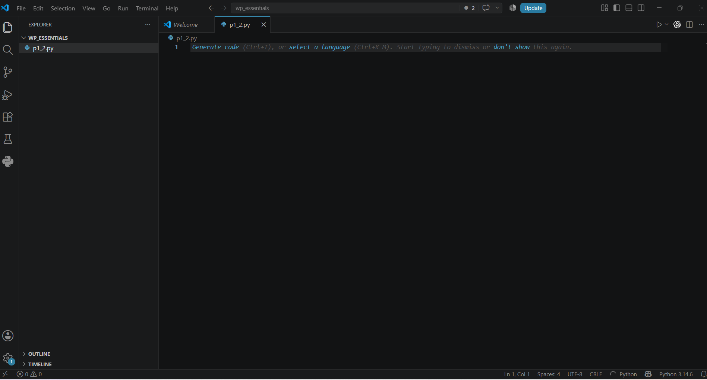

---

# Conclusión

En esta práctica creaste tu primer programa en Python utilizando Visual Studio Code. Aprendiste a organizar un proyecto, crear un archivo con extensión `.py`, ejecutar un script y visualizar la salida generada por la función `print()`.

También observaste que Python ejecuta directamente el código fuente sin generar un archivo ejecutable, característica propia de los lenguajes interpretados.

---

# Conocimientos adquiridos

Al finalizar esta práctica aprendiste a:

- Crear proyectos en Python.
- Utilizar Visual Studio Code para desarrollar programas.
- Ejecutar scripts desde el editor o la terminal.
- Utilizar la función `print()`.
- Comprender el proceso básico de ejecución de un programa en Python.