# Práctica 2.1. Consola interactiva de Python en Visual Studio Code

## Objetivo de la práctica

Al finalizar esta práctica, serás capaz de:

- Iniciar la consola interactiva de Python desde la terminal integrada de Visual Studio Code.
- Ejecutar instrucciones directamente en el intérprete de Python.
- Comprender la diferencia entre errores de tipo y errores por variables no definidas.
- Identificar el funcionamiento básico del intérprete interactivo de Python.

---

# Objetivo visual

En esta práctica utilizarás la consola interactiva de Python para ejecutar instrucciones y analizar el comportamiento del lenguaje.

```text
         Abrir Visual Studio Code
                    │
                    ▼
          Abrir una Terminal
                    │
                    ▼
      Iniciar la consola de Python
                    │
                    ▼
      Ejecutar expresiones simples
                    │
                    ▼
        Analizar los errores
                    │
                    ▼
      Declarar una variable
                    │
                    ▼
          Imprimir su contenido
                    │
                    ▼
      Salir del intérprete Python
```


---

## Duración aproximada

**5 minutos**

---

# Tabla de ayuda

| Recurso | Valor |
|---------|-------|
| Editor | Visual Studio Code |
| Intérprete | Python 3 |
| Terminal | Terminal integrada |
| Comando para iniciar Python | `python` |
| Comando para salir | `exit()` |

---

# Instrucciones

## Tarea 1. Iniciar la consola interactiva de Python

### Paso 1. Abrir Visual Studio Code

Abrir Visual Studio Code y verificar que el proyecto del curso se encuentre abierto.


---

### Paso 2. Abrir una terminal integrada

Ir al menú:

**Terminal → New Terminal**

También puede utilizar el atajo:

```
Ctrl + Shift + `
```

Se abrirá una terminal en la parte inferior del editor.

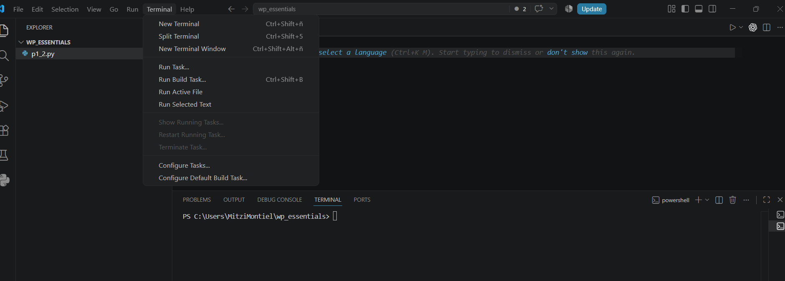

---

### Paso 3. Iniciar la consola interactiva

En la terminal escribir:

```bash
python
```

Deberá aparecer el prompt interactivo de Python similar al siguiente:

```text
>>>
```

> **Nota:** El símbolo `>>>` indica que el intérprete está listo para recibir instrucciones.


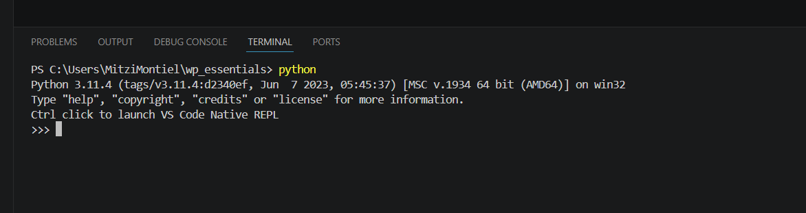

---

## Tarea 2. Experimentar con el intérprete

### Paso 1. Ejecutar una operación inválida

Escribir:

```python
5 + "Hola"
```

Observar el mensaje de error.

Responder:

- ¿Por qué se produjo el error?

> **Pista:** Python no permite sumar directamente un número entero con una cadena de texto.

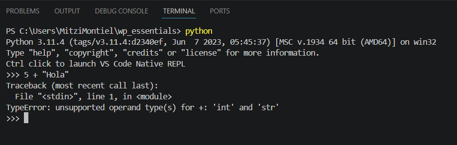

---

### Paso 2. Corregir la operación

Escribir:

```python
str(5) + "Hola"
```

Observar el resultado.

Responder:

- ¿Qué hace la función `str()`?

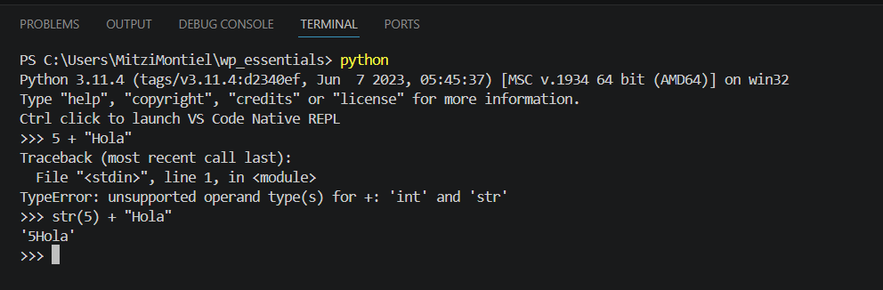

---

### Paso 3. Salir del intérprete

Escribir:

```python
exit()
```

Volverá a la terminal del sistema.

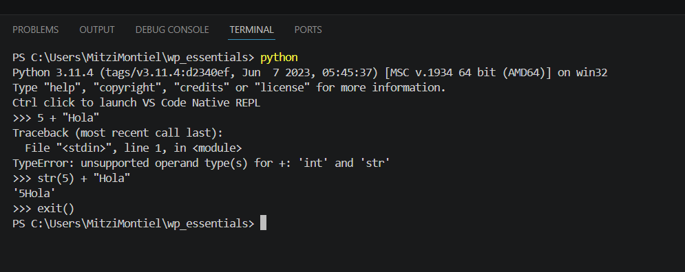

---

## Tarea 3. Comprender el uso de variables

### Paso 1. Iniciar nuevamente el intérprete

Ejecutar nuevamente:

```bash
python
```

---

### Paso 2. Intentar imprimir una variable inexistente

Escribir:

```python
print(xxx)
```

Observar el mensaje de error.

Responder:

- ¿Qué significa el error mostrado?
- ¿Por qué Python no puede imprimir la variable?

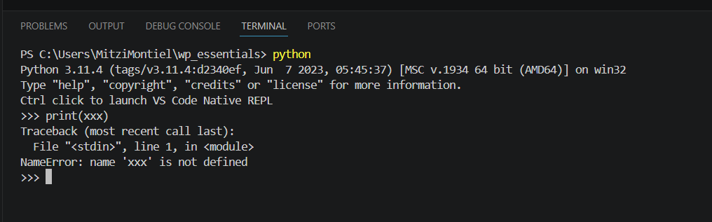

---

### Paso 3. Declarar una variable

Escribir:

```python
xxx = "Un nuevo mensaje"
```

Después ejecutar:

```python
print(xxx)
```

Verificar que el mensaje se imprima correctamente.

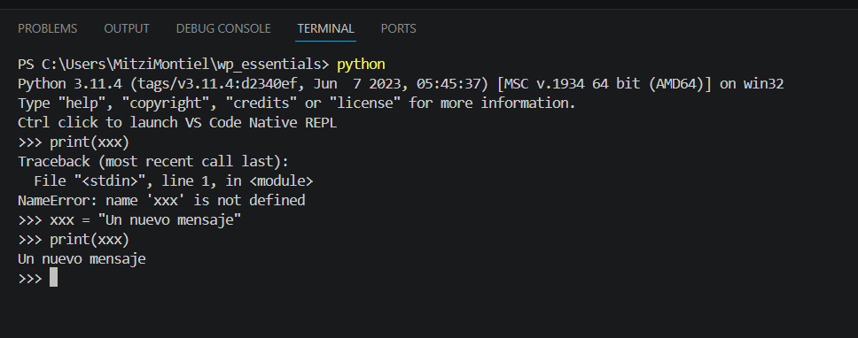

---

### Paso 4. Salir del intérprete

Escribir:

```python
exit()
```

---

# Validación

Verifique que realizó correctamente las siguientes actividades.

| Actividad | Completado |
|------------|------------|
| Abrió la terminal integrada de VS Code | ☐ |
| Inició el intérprete de Python | ☐ |
| Identificó un TypeError | ☐ |
| Utilizó correctamente la función `str()` | ☐ |
| Identificó un NameError | ☐ |
| Declaró una variable | ☐ |
| Imprimió el contenido de la variable | ☐ |

---

# Resultado esperado

Al finalizar la práctica deberá comprender la diferencia entre:

- Un error de tipo (**TypeError**).
- Un error por variable inexistente (**NameError**).
- El funcionamiento básico del intérprete interactivo de Python.

---

# Conclusión

En esta práctica utilizaste el intérprete interactivo de Python desde la terminal integrada de Visual Studio Code. Aprendiste a ejecutar instrucciones de forma inmediata, identificar errores comunes y crear variables para almacenar información.

El intérprete interactivo es una excelente herramienta para realizar pruebas rápidas antes de escribir programas completos.

---

# Conocimientos adquiridos

Al finalizar esta práctica aprendiste a:

- Utilizar la consola interactiva de Python.
- Ejecutar instrucciones desde Visual Studio Code.
- Comprender los errores TypeError y NameError.
- Declarar variables.
- Convertir tipos de datos utilizando la función `str()`.

---
# Práctica 2.2. Explorando tipos de datos

## Objetivo de la práctica

Al finalizar esta práctica, serás capaz de:

- Utilizar la función `type()` para identificar el tipo de dato de diferentes expresiones.
- Crear un script en Python que muestre información en la consola.
- Reconocer los tipos de datos básicos disponibles en Python.

---

# Objetivo visual

Durante esta práctica crearás un programa que utilizará la función `type()` para identificar distintos tipos de datos.

```text
      Abrir Visual Studio Code
                 │
                 ▼
        Crear el archivo p2_2.py
                 │
                 ▼
      Escribir llamadas a type()
                 │
                 ▼
      Mostrar resultados con print()
                 │
                 ▼
         Ejecutar el programa
                 │
                 ▼
      Analizar los tipos obtenidos
```


---

## Duración aproximada

**7 minutos**

---

# Tabla de ayuda

| Recurso | Valor |
|---------|-------|
| Editor | Visual Studio Code |
| Lenguaje | Python 3 |
| Archivo | `p2_2.py` |
| Funciones utilizadas | `print()`, `type()` |

---

# Instrucciones

## Tarea 1. Crear el programa

### Paso 1. Abrir Visual Studio Code

Abrir Visual Studio Code y abrir la carpeta del laboratorio WP_ESSENTIALS.
---

### Paso 2. Crear un nuevo archivo

Crear un archivo llamado:

```text
p2_2.py
```

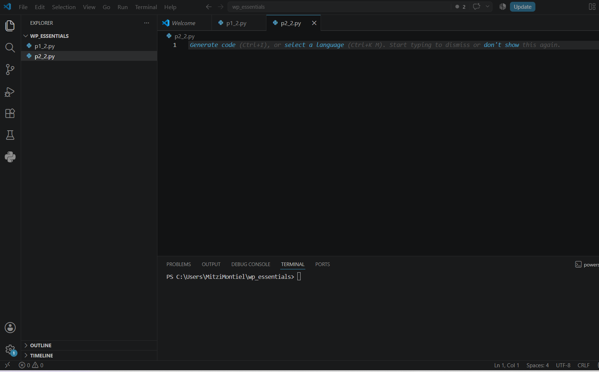

---

### Paso 3. Escribir el siguiente código

Agregar el siguiente programa.

```python
print(type(3))
print(type(3.1))
print(type("3"))
print(type('3'))
print(type("pizza"))
print(type(1 == 1))
print(type(1 + 1j))
print(type(True))
print(type(False))
print(type(None))
print(type(print))
```

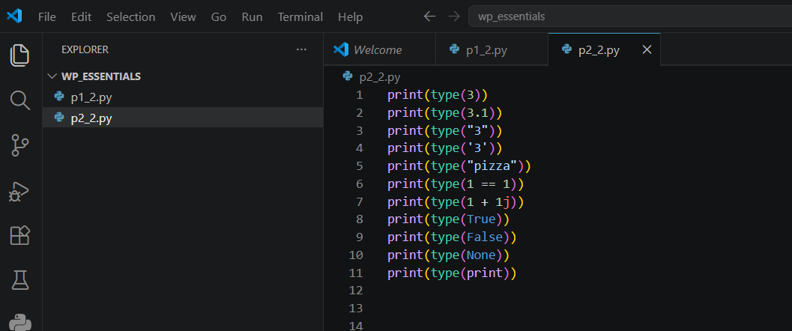

Guardar el archivo.

---

## Tarea 2. Ejecutar el programa

### Paso 1. Ejecutar el script

Ejecutar el programa utilizando el botón **Run Python File** o mediante la terminal.

```bash
python p2_2.py
```

Observar la salida mostrada en la terminal.


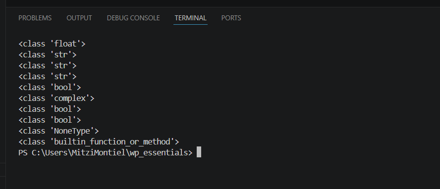

---

### Paso 2. Analizar los resultados

Comparar cada resultado con la expresión evaluada.

| Expresión | Tipo obtenido |
|-----------|---------------|
| `3` | |
| `3.1` | |
| `"3"` | |
| `'3'` | |
| `"pizza"` | |
| `1 == 1` | |
| `1 + 1j` | |
| `True` | |
| `False` | |
| `None` | |
| `print` | |

---

## Tarea 3. Analizar la información

Responder las siguientes preguntas.

1. ¿Qué diferencia existe entre `3` y `"3"`?

2. ¿Qué tipo de dato devuelve una comparación como `1 == 1`?

3. ¿Qué representa el tipo `NoneType`?

4. ¿Qué puede concluir acerca del uso de la función `type()`?

5. ¿Puede concluir que todos los elementos en Python poseen un tipo de dato? Justifique su respuesta.

---

# Validación

Verifique que realizó correctamente las siguientes actividades.

| Actividad | Completado |
|------------|------------|
| Creó el archivo `p2_2.py` | ☐ |
| Escribió el programa | ☐ |
| Ejecutó correctamente el script | ☐ |
| Identificó los tipos de datos | ☐ |
| Respondió las preguntas de análisis | ☐ |

---

# Resultado esperado

La salida del programa deberá ser similar a la siguiente:

```text
<class 'int'>
<class 'float'>
<class 'str'>
<class 'str'>
<class 'str'>
<class 'bool'>
<class 'complex'>
<class 'bool'>
<class 'bool'>
<class 'NoneType'>
<class 'builtin_function_or_method'>
```

---

# Conclusión

En esta práctica desarrollaste un programa que utiliza la función `type()` para identificar el tipo de dato de diferentes expresiones. Observaste que números, cadenas de texto, valores booleanos, números complejos, funciones y el valor especial `None` poseen un tipo asociado.

Comprender los tipos de datos es fundamental para escribir programas correctos y aprovechar las capacidades del lenguaje Python.

---

# Conocimientos adquiridos

Al finalizar esta práctica aprendiste a:

- Utilizar la función `type()`.
- Mostrar resultados mediante `print()`.
- Identificar los principales tipos de datos de Python.
- Diferenciar entre datos numéricos, cadenas, valores booleanos y otros objetos.

---
# Práctica 2.3. Expresiones y asignación de variables

## Objetivo de la práctica

Al finalizar esta práctica, serás capaz de:

- Comprender el funcionamiento de la asignación de variables en Python.
- Analizar cómo cambian los valores almacenados en las variables durante la ejecución de un programa.
- Evaluar expresiones aritméticas y expresiones con cadenas de texto utilizando operadores de Python.

---

# Objetivo visual

Durante esta práctica crearás un programa para experimentar con asignaciones de variables y expresiones.

```text
        Abrir Visual Studio Code
                   │
                   ▼
          Crear el archivo p2_3.py
                   │
                   ▼
      Escribir asignaciones de variables
                   │
                   ▼
        Ejecutar el programa
                   │
                   ▼
     Analizar los resultados obtenidos
                   │
                   ▼
     Experimentar con expresiones
                   │
                   ▼
        Obtener conclusiones
```


---

## Duración aproximada

**10 minutos**

---

# Tabla de ayuda

| Recurso | Valor |
|---------|-------|
| Editor | Visual Studio Code |
| Lenguaje | Python 3 |
| Archivo | `p2_3.py` |
| Función utilizada | `print()` |

---

# Instrucciones

## Tarea 1. Comprender la asignación de variables

### Paso 1. Crear un nuevo archivo

Crear un archivo llamado:

```text
p2_3.py
```
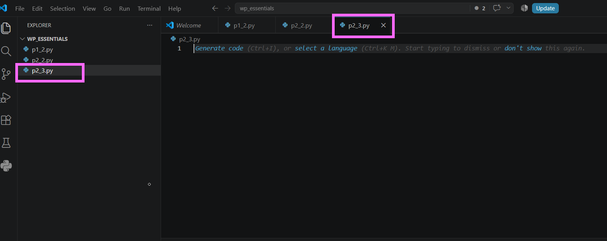

---

### Paso 2. Escribir el siguiente código

Agregar las siguientes instrucciones.

```python
a = 1
b = 3
c = a

a = b
b = c

print(a, b)
```

Guardar el archivo.

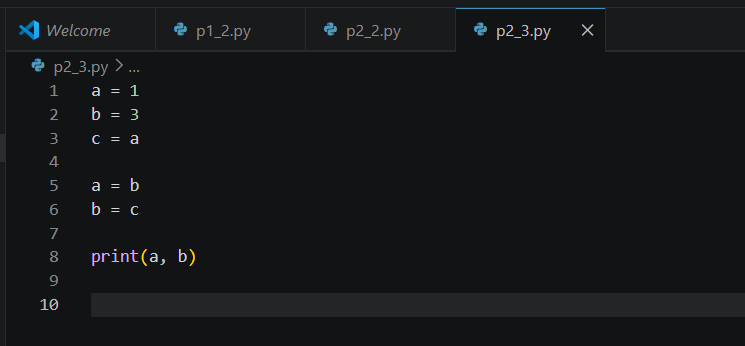


---

### Paso 3. Ejecutar el programa

Ejecutar el archivo utilizando el botón **Run Python File** o mediante la terminal.

```bash
python p2_3.py
```

Observar el resultado.

Responder:

- ¿Cuál fue el valor final de `a`?
- ¿Cuál fue el valor final de `b`?
- ¿Por qué ocurrió ese resultado?

**Captura esperada**

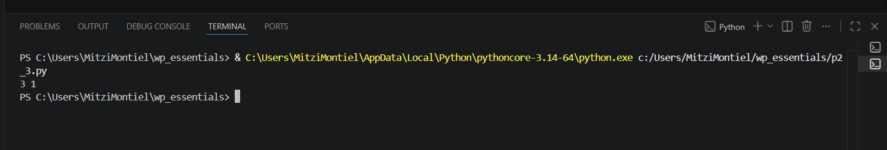
```

---

## Tarea 2. Intercambiar valores utilizando asignación múltiple

### Paso 1. Reemplazar el código anterior

Sustituir el contenido del archivo por el siguiente código.

```python
a, b = 1, 2

b, a = a, b

print(a, b)
```

Guardar el archivo.

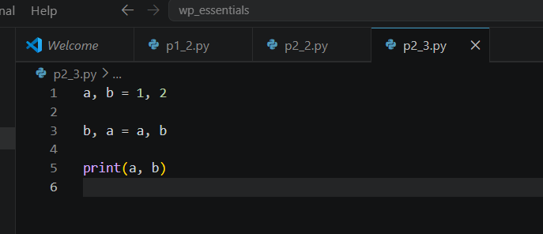

---

### Paso 2. Ejecutar nuevamente el programa

Ejecutar el script y observar el resultado.

Responder:

- ¿Qué ventaja tiene la asignación múltiple?
- ¿Fue necesario utilizar una variable auxiliar?


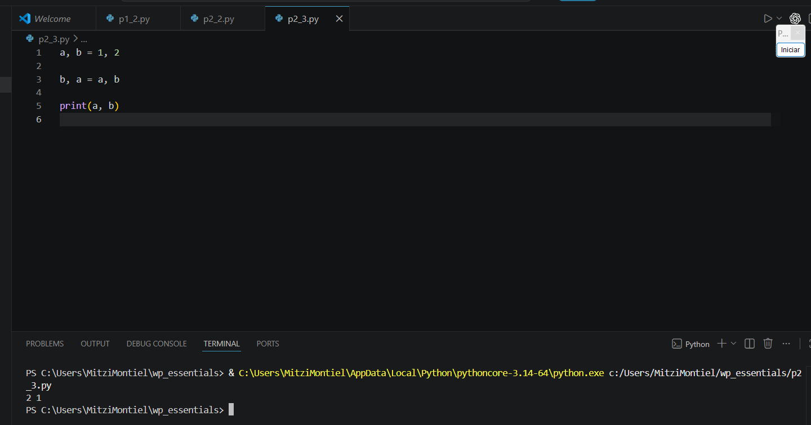

---

## Tarea 3. Explorar expresiones con cadenas

### Paso 1. Reemplazar el código por el siguiente

```python
x = "6"
y = "8"

print(x + y)
print(y + x)
print(x * 3)
```

Guardar el archivo.

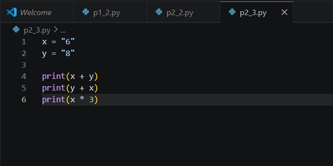

---

### Paso 2. Ejecutar el programa

Observar cuidadosamente los resultados obtenidos.

Responder:

- ¿Qué operación realiza el operador `+` cuando trabaja con cadenas?
- ¿Qué operación realiza el operador `*` cuando trabaja con cadenas?


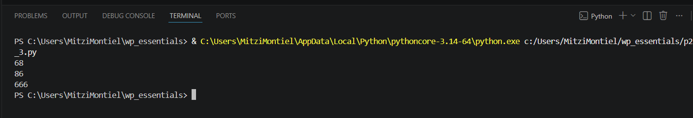

---

## Tarea 4. Evaluar una expresión aritmética

### Paso 1. Agregar el siguiente código

```python
a = 2

b = a / a + a ** a - a

print(b)
print(type(b))
```

Guardar el archivo.

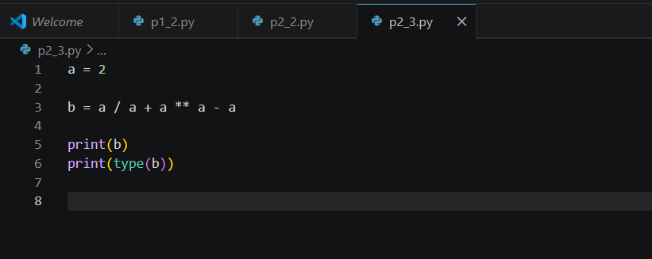

---

### Paso 2. Ejecutar el programa

Analizar el resultado obtenido.

Responder:

- ¿Cuál fue el valor almacenado en `b`?
- ¿Qué tipo de dato tiene la variable `b`?
- ¿Qué operador tiene mayor prioridad en la expresión?

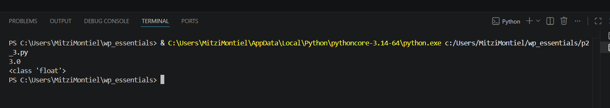

---

# Validación

Verifique que realizó correctamente las siguientes actividades.

| Actividad | Completado |
|------------|------------|
| Creó el archivo `p2_3.py` | ☐ |
| Ejecutó el primer programa | ☐ |
| Comprendió el intercambio de variables | ☐ |
| Utilizó asignación múltiple | ☐ |
| Evaluó expresiones con cadenas | ☐ |
| Evaluó expresiones aritméticas | ☐ |
| Identificó el tipo de dato del resultado | ☐ |

---

# Resultado esperado

Al finalizar la práctica comprenderá que:

- Las variables pueden cambiar su valor durante la ejecución del programa.
- Python permite intercambiar variables mediante asignación múltiple.
- El operador `+` concatena cadenas de texto.
- El operador `*` repite cadenas de texto.
- Los operadores aritméticos respetan un orden de precedencia.

---

# Conclusión

Durante esta práctica experimentaste con la asignación de variables y la evaluación de expresiones en Python. Observaste cómo cambian los valores almacenados en las variables, cómo es posible intercambiar valores utilizando asignación múltiple y cómo los operadores pueden comportarse de forma diferente dependiendo del tipo de dato con el que trabajan.

También comprobaste que Python respeta un orden de precedencia al evaluar expresiones aritméticas, lo que permite obtener resultados consistentes y predecibles.

---

# Conocimientos adquiridos

Al finalizar esta práctica aprendiste a:

- Asignar valores a variables.
- Intercambiar valores mediante asignación múltiple.
- Utilizar el operador `+` para concatenar cadenas.
- Utilizar el operador `*` para repetir cadenas.
- Evaluar expresiones aritméticas.
- Identificar el tipo de dato del resultado mediante `type()`.

---
# Práctica 2.4. Tipado dinámico

## Objetivo de la práctica

Al finalizar esta práctica, serás capaz de:

- Comprender el concepto de **tipado dinámico** en Python.
- Observar cómo una misma variable puede almacenar diferentes tipos de datos durante la ejecución del programa.
- Verificar el tipo de dato de una variable utilizando la función `type()`.

---

# Objetivo visual

Durante esta práctica crearás un programa que demostrará cómo una variable puede cambiar de tipo durante la ejecución.

```text
        Abrir Visual Studio Code
                   │
                   ▼
         Crear el archivo p2_4.py
                   │
                   ▼
       Asignar diferentes valores
                   │
                   ▼
      Utilizar la función type()
                   │
                   ▼
         Ejecutar el programa
                   │
                   ▼
      Analizar los resultados
                   │
                   ▼
      Comprender el tipado dinámico
```

---

## Duración aproximada

**10 minutos**

---

# Tabla de ayuda

| Recurso | Valor |
|---------|-------|
| Editor | Visual Studio Code |
| Lenguaje | Python 3 |
| Archivo | `p2_4.py` |
| Funciones utilizadas | `print()`, `type()` |

---

# Instrucciones

## Tarea 1. Crear el programa

### Paso 1. Crear un nuevo archivo

Crear un archivo llamado:

```text
p2_4.py
```
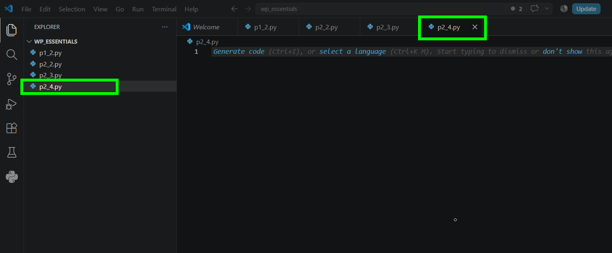


---

### Paso 2. Escribir el siguiente código

Agregar el siguiente programa.

```python
a = 65
print(a)
print(type(a))

a = "Hola Participante de Python"
print(a)
print(type(a))

a = 10 + 5j
print(a)
print(type(a))

a = 10 / 2
print(a)
print(type(a))
```

Guardar el archivo.

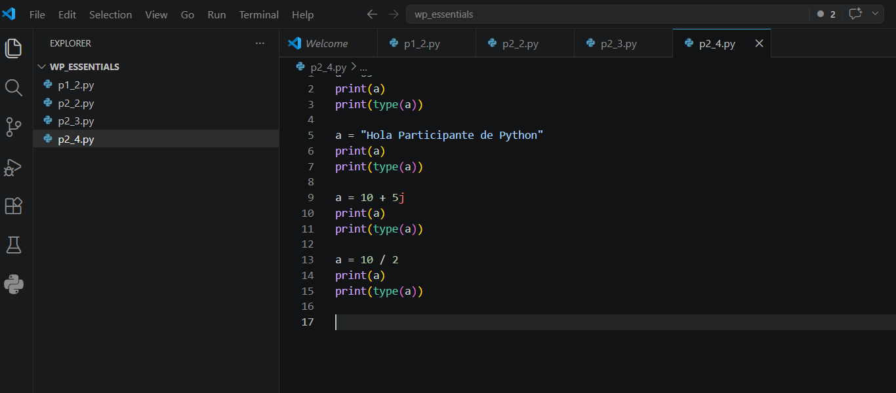

---

## Tarea 2. Ejecutar el programa

### Paso 1. Ejecutar el script

Ejecutar el programa utilizando el botón **Run Python File** o mediante la terminal.

```bash
python p2_4.py
```

Observar cuidadosamente la salida generada.

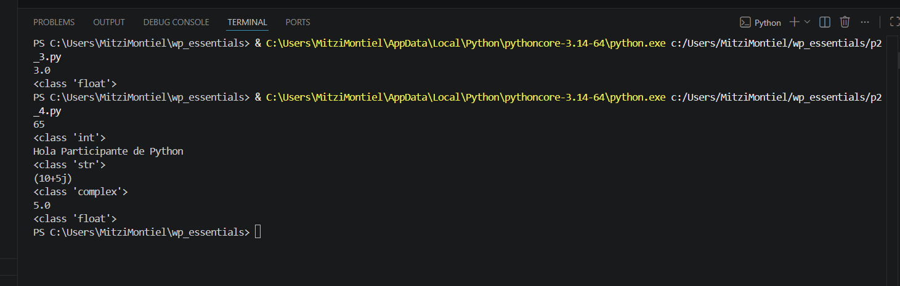

---

### Paso 2. Analizar los resultados

Completar la siguiente tabla.

| Valor asignado | Tipo de dato |
|---------------|--------------|
| `65` | |
| `"Hola Participante de Python"` | |
| `10 + 5j` | |
| `10 / 2` | |

---

## Tarea 3. Reflexionar sobre el tipado dinámico

Responder las siguientes preguntas.

1. ¿Cuántas veces cambió el contenido de la variable `a`?

2. ¿Fue necesario declarar previamente el tipo de dato de la variable?

3. ¿Qué función permitió identificar el tipo de dato almacenado?

4. ¿Qué significa que Python sea un lenguaje de **tipado dinámico**?

5. ¿Qué ventajas considera que ofrece esta característica al desarrollar programas?

> **Nota:** En Python el tipo de dato no pertenece a la variable, sino al objeto que la variable referencia. Por ello, una misma variable puede almacenar distintos tipos de datos durante la ejecución del programa.

---

# Validación

Verifique que realizó correctamente las siguientes actividades.

| Actividad | Completado |
|------------|------------|
| Creó el archivo `p2_4.py` | ☐ |
| Escribió el programa | ☐ |
| Ejecutó correctamente el script | ☐ |
| Observó los cambios de tipo de la variable | ☐ |
| Utilizó la función `type()` | ☐ |
| Respondió las preguntas de análisis | ☐ |

---

# Resultado esperado

Al finalizar la práctica deberá observar una salida similar a la siguiente.

```text
65
<class 'int'>

Hola Participante de Python
<class 'str'>

(10+5j)
<class 'complex'>

5.0
<class 'float'>
```


---

# Conclusión

En esta práctica comprobaste que una misma variable puede almacenar distintos tipos de datos durante la ejecución del programa sin necesidad de declarar previamente su tipo. Este comportamiento es una de las principales características de Python y se conoce como **tipado dinámico**.

También verificaste que la función `type()` permite identificar el tipo del objeto almacenado en una variable en cualquier momento del programa.

---

# Conocimientos adquiridos

Al finalizar esta práctica aprendiste a:

- Comprender el concepto de tipado dinámico.
- Reutilizar una misma variable con distintos tipos de datos.
- Identificar el tipo de un objeto mediante la función `type()`.
- Diferenciar entre el nombre de una variable y el objeto que referencia.