# Práctica 3.1. Expresiones y entrada de datos

## Objetivo de la práctica

Al finalizar esta práctica, serás capaz de:

- Solicitar información al usuario utilizando la función `input()`.
- Comprender que la función `input()` siempre devuelve una cadena de caracteres.
- Realizar operaciones aritméticas con datos ingresados por el usuario mediante la conversión de tipos.
- Evaluar expresiones booleanas utilizando las funciones `min()` y `max()`.

---

# Objetivo visual

Durante esta práctica desarrollarás un programa que interactúa con el usuario mediante la entrada de datos.

```text
        Abrir Visual Studio Code
                   │
                   ▼
         Crear el archivo p3_1.py
                   │
                   ▼
     Solicitar datos con input()
                   │
                   ▼
      Convertir datos numéricos
                   │
                   ▼
      Realizar operaciones
                   │
                   ▼
      Mostrar resultados
                   │
                   ▼
      Analizar expresiones booleanas
```


---

## Duración aproximada

**8 minutos**

---

# Tabla de ayuda

| Recurso | Valor |
|---------|-------|
| Editor | Visual Studio Code |
| Lenguaje | Python 3 |
| Archivo | `p3_1.py` |
| Funciones utilizadas | `input()`, `print()`, `int()`, `min()`, `max()` |

---

# Instrucciones

## Tarea 1. Solicitar un dato al usuario

### Paso 1. Crear un nuevo archivo

Crear un archivo llamado:

```text
p3_1.py
```
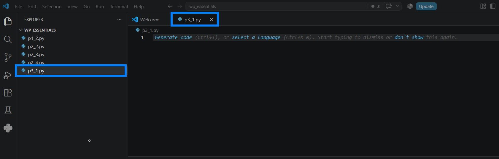

---

### Paso 2. Solicitar un número

Escribir el siguiente código.

```python
numero = input("Ingrese un número: ")

print(numero)
print(type(numero))
```

Guardar el archivo.

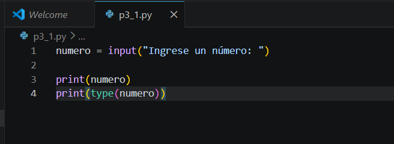


---

### Paso 3. Ejecutar el programa

Ejecutar el programa y escribir cualquier número cuando sea solicitado.

Observar el tipo de dato mostrado por la función `type()`.

Responder:

- ¿Qué tipo de dato devuelve la función `input()`?

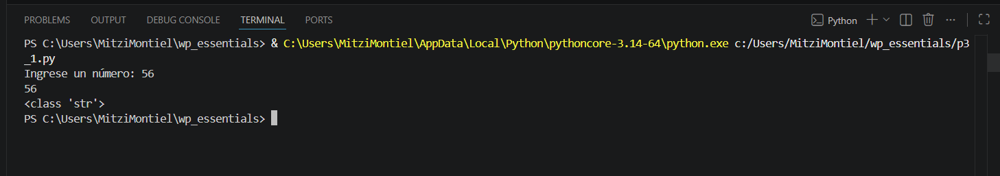

---

## Tarea 2. Calcular el cubo de un número

### Paso 1. Modificar el programa

Reemplazar el código anterior por el siguiente.

```python
numero = int(input("Ingrese un número: "))

print("El cubo de", numero, "es:", numero ** 3)
```

Guardar el archivo.

> **Nota:** La función `int()` convierte la cadena de texto capturada por `input()` en un número entero.


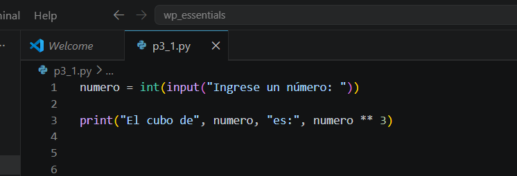

---

### Paso 2. Ejecutar el programa

Ingresar un número y verificar el resultado obtenido.

Responder:

- ¿Qué operador se utilizó para calcular el cubo?

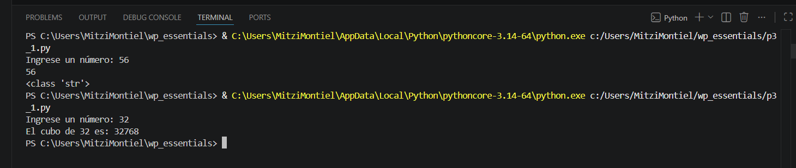

---

## Tarea 3. Evaluar expresiones booleanas

### Paso 1. Agregar el siguiente código

```python
print(min(True, False))
print(max(True, False))
```

Guardar el archivo y ejecutar nuevamente.

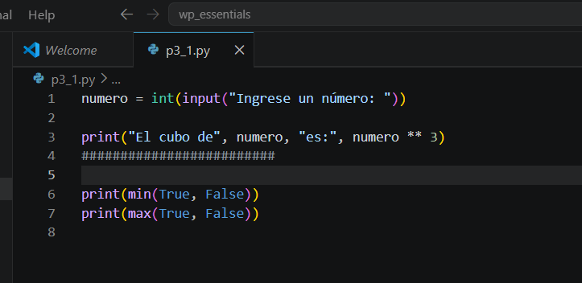


Responder:

- ¿Qué resultado devuelve `min(True, False)`?
- ¿Qué resultado devuelve `max(True, False)`?


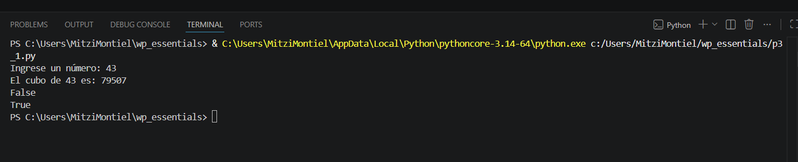

---

## Tarea 4. Crear una calculadora básica

### Paso 1. Reemplazar el código anterior

Escribir el siguiente programa.

```python
numero1 = float(input("Ingrese el primer número: "))
numero2 = float(input("Ingrese el segundo número: "))

print("Suma:", numero1 + numero2)
print("Resta:", numero1 - numero2)
print("Multiplicación:", numero1 * numero2)
print("División:", numero1 / numero2)
```

Guardar el archivo.

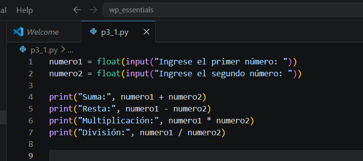

---

### Paso 2. Ejecutar el programa

Ingresar dos números y verificar los resultados.

Responder:

- ¿Por qué en esta ocasión se utilizó `float()` en lugar de `int()`?
- ¿Qué ocurre si el segundo número ingresado es cero?

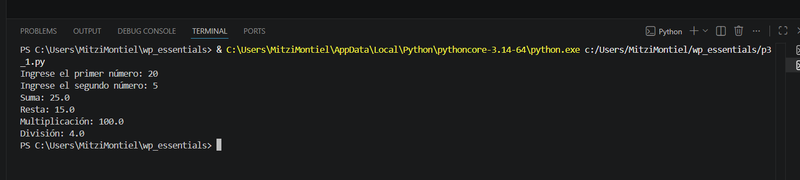

---

# Validación

Verifique que realizó correctamente las siguientes actividades.

| Actividad | Completado |
|------------|------------|
| Creó el archivo `p3_1.py` | ☐ |
| Utilizó la función `input()` | ☐ |
| Convirtió datos con `int()` | ☐ |
| Calculó el cubo de un número | ☐ |
| Evaluó las funciones `min()` y `max()` | ☐ |
| Desarrolló una calculadora básica | ☐ |

---

# Resultado esperado

Al finalizar la práctica deberá ser capaz de interactuar con el usuario mediante la función `input()` y realizar operaciones aritméticas utilizando los datos capturados.

También comprenderá que la función `input()` devuelve una cadena de caracteres y que es necesario convertirla cuando se desea realizar operaciones matemáticas.


---

# Conclusión

En esta práctica aprendiste a crear programas interactivos que solicitan información al usuario mediante la función `input()`. También comprobaste la importancia de convertir los datos capturados antes de utilizarlos en operaciones matemáticas y reforzaste el uso de operadores aritméticos y funciones integradas de Python.

La interacción con el usuario es una de las características fundamentales en el desarrollo de aplicaciones y será utilizada constantemente en los siguientes capítulos.

---

# Conocimientos adquiridos

Al finalizar esta práctica aprendiste a:

- Utilizar la función `input()`.
- Convertir cadenas de texto a valores numéricos mediante `int()` y `float()`.
- Calcular potencias utilizando el operador `**`.
- Evaluar expresiones booleanas con `min()` y `max()`.
- Desarrollar programas interactivos que solicitan información al usuario.

---

# Práctica 3.2. Métodos de las cadenas de caracteres

## Objetivo de la práctica

Al finalizar esta práctica, serás capaz de:

- Utilizar los principales métodos de las cadenas de caracteres en Python.
- Aplicar operaciones de búsqueda, transformación y limpieza de texto.
- Comprender que los métodos de las cadenas devuelven un nuevo valor sin modificar la cadena original.

---

# Objetivo visual

Durante esta práctica desarrollarás un programa para manipular cadenas de caracteres utilizando los métodos integrados de Python.

```text
        Abrir Visual Studio Code
                   │
                   ▼
         Crear el archivo p3_2.py
                   │
                   ▼
      Solicitar una frase al usuario
                   │
                   ▼
      Aplicar métodos de cadenas
                   │
                   ▼
        Ejecutar el programa
                   │
                   ▼
      Analizar los resultados
```
---

## Duración aproximada

**8 minutos**

---

# Tabla de ayuda

| Recurso | Valor |
|---------|-------|
| Editor | Visual Studio Code |
| Lenguaje | Python 3 |
| Archivo | `p3_2.py` |
| Funciones utilizadas | `input()`, `print()`, `len()` |
| Métodos utilizados | `upper()`, `lower()`, `strip()`, `replace()`, `join()` |

---

# Instrucciones

## Tarea 1. Capturar una frase

### Paso 1. Crear un nuevo archivo

Crear un archivo llamado:

```text
p3_2.py
```

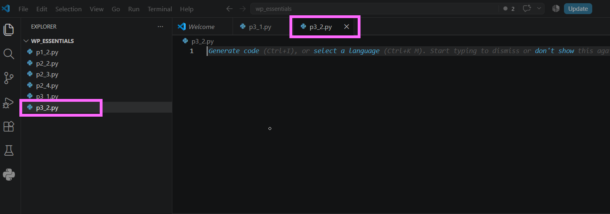

---

### Paso 2. Escribir el siguiente código

```python
frase = input("Ingrese una frase: ")

print("Frase original:")
print(frase)
```

Guardar el archivo.

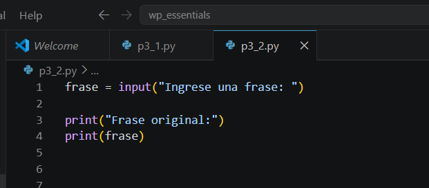

---

### Paso 3. Ejecutar el programa

Ingresar cualquier frase.

Verificar que el texto ingresado se muestre correctamente.

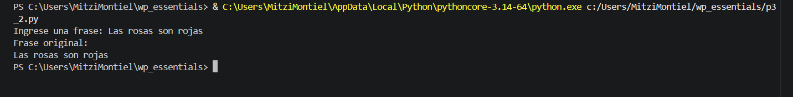

---

## Tarea 2. Explorar métodos de cadenas

### Paso 1. Mostrar la longitud de la cadena

Agregar la siguiente instrucción.

```python
print("Cantidad de caracteres:", len(frase))
```
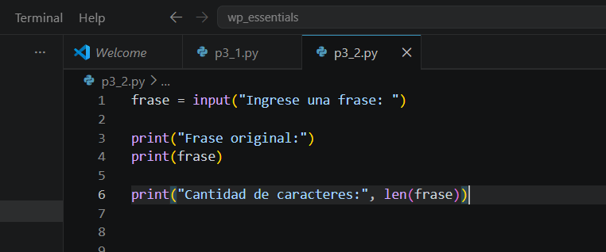

Ejecutar nuevamente el programa.

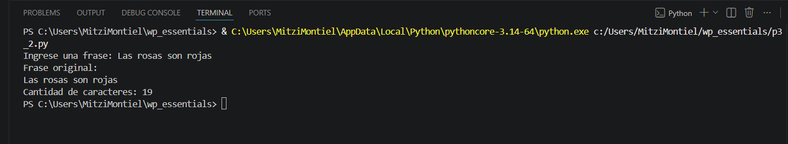

---

### Paso 2. Verificar si existe una palabra

Agregar el siguiente código.

```python
print("Python" in frase)
```
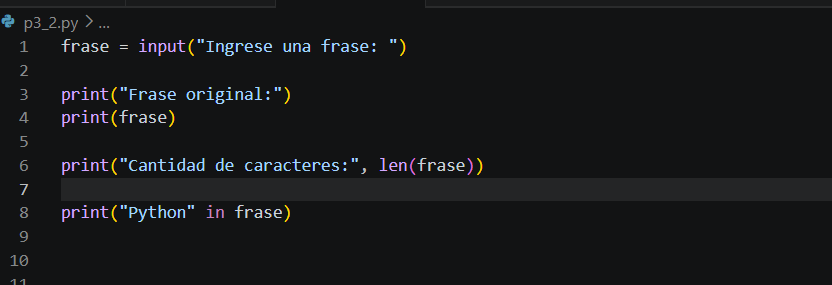

Ejecutar nuevamente el programa.

> **Nota:** El operador `in` verifica si una subcadena se encuentra dentro de otra cadena.

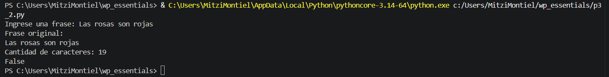

---

### Paso 3. Convertir la cadena a mayúsculas

Agregar:

```python
print(frase.upper())
```
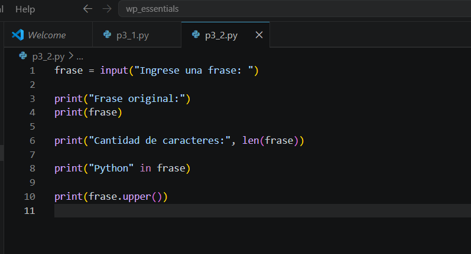


---

### Paso 4. Convertir la cadena a minúsculas

Agregar:

```python
print(frase.lower())
```

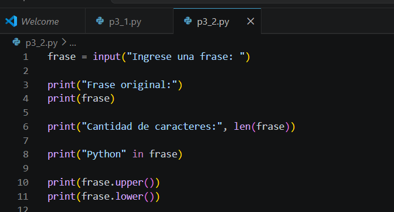

Observa la salida al ejecutar el código:

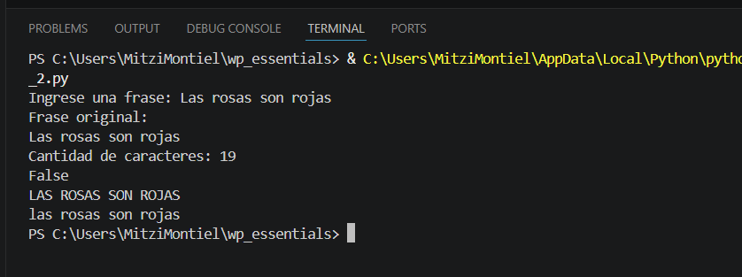


---

### Paso 5. Eliminar espacios al inicio y al final

Agregar:

```python
print(frase.strip())
```

Después agregar:

```python
print("Longitud original:", len(frase))
print("Longitud sin espacios:", len(frase.strip()))
```


Responder:

- ¿Por qué la longitud de la variable `frase` no cambia?

> **Pista:** Los métodos de las cadenas devuelven una nueva cadena y no modifican la original.


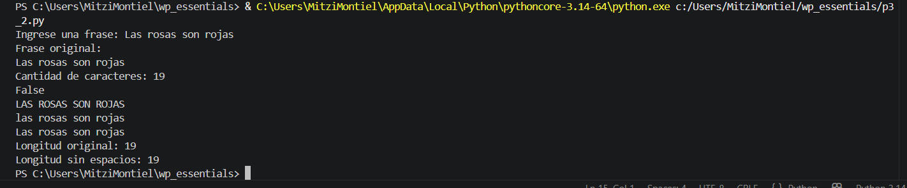


---

### Paso 6. Reemplazar caracteres

Agregar:

```python
print(frase.replace("a", "A"))
```

Ejecutar nuevamente el programa.

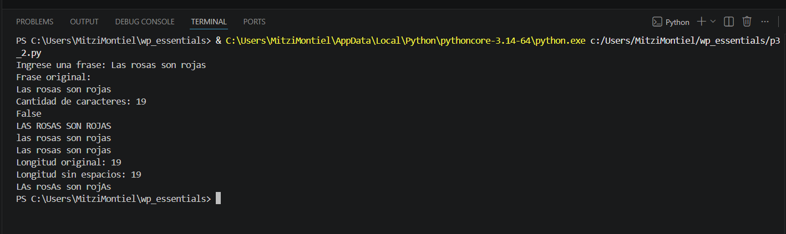


---

### Paso 7. Utilizar el método `join()`

Agregar el siguiente código.

```python
print("\n".join("Hola Python"))
```

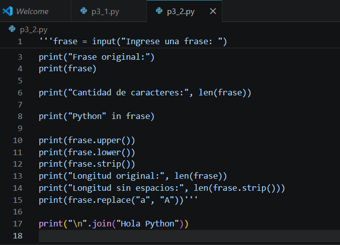

Ejecutar nuevamente el programa.

Responder:

- ¿Qué hace el método `join()`?
- ¿Por qué aparece cada carácter en una línea diferente?

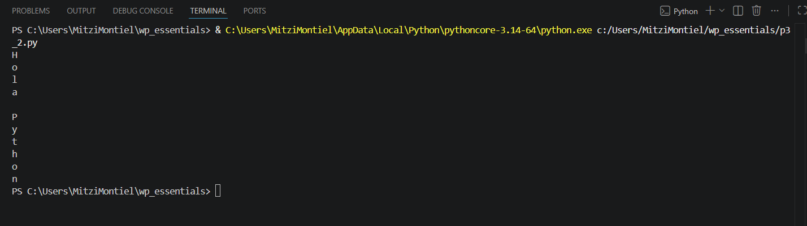

---

## Tarea 3. Analizar los resultados

Responder las siguientes preguntas.

1. ¿Qué método convierte una cadena a mayúsculas?

2. ¿Qué método convierte una cadena a minúsculas?

3. ¿Qué hace el método `strip()`?

4. ¿Cuál es la diferencia entre `replace()` y `strip()`?

5. ¿Por qué los métodos de las cadenas no modifican la variable original?

---

# Validación

Verifique que realizó correctamente las siguientes actividades.

| Actividad | Completado |
|------------|------------|
| Creó el archivo `p3_2.py` | ☐ |
| Capturó una frase con `input()` | ☐ |
| Calculó la longitud con `len()` | ☐ |
| Utilizó el operador `in` | ☐ |
| Aplicó `upper()` | ☐ |
| Aplicó `lower()` | ☐ |
| Aplicó `strip()` | ☐ |
| Aplicó `replace()` | ☐ |
| Utilizó el método `join()` | ☐ |

---

# Resultado esperado

Al finalizar la práctica el participante comprenderá que las cadenas de caracteres disponen de numerosos métodos que permiten manipular texto de forma sencilla y eficiente.

También observará que los métodos de las cadenas generan nuevas cadenas de caracteres, manteniendo intacto el contenido original.


---

# Conclusión

En esta práctica exploraste algunos de los métodos más utilizados para manipular cadenas de caracteres en Python. Aprendiste a convertir texto a mayúsculas y minúsculas, eliminar espacios innecesarios, reemplazar caracteres y verificar si una subcadena se encuentra dentro de otra.

Además, comprobaste que las cadenas son objetos **inmutables**, por lo que los métodos no modifican el contenido original, sino que generan una nueva cadena con el resultado de la operación.

---

# Conocimientos adquiridos

Al finalizar esta práctica aprendiste a:

- Capturar cadenas de texto mediante `input()`.
- Obtener la longitud de una cadena con `len()`.
- Buscar subcadenas utilizando el operador `in`.
- Convertir texto con `upper()` y `lower()`.
- Eliminar espacios con `strip()`.
- Reemplazar caracteres con `replace()`.
- Utilizar el método `join()`.
- Comprender la inmutabilidad de las cadenas en Python.

---

# Práctica 3.3. Indexación de cadenas

## Objetivo de la práctica

Al finalizar esta práctica, serás capaz de:

- Acceder a caracteres individuales de una cadena mediante su posición.
- Comprender el funcionamiento de la indexación en Python.
- Obtener un carácter específico utilizando un índice proporcionado por el usuario.

---

# Objetivo visual

Durante esta práctica desarrollarás un programa que permitirá localizar un carácter dentro de una cadena utilizando su posición.

```text
        Abrir Visual Studio Code
                   │
                   ▼
         Crear el archivo p3_3.py
                   │
                   ▼
      Solicitar una frase al usuario
                   │
                   ▼
      Solicitar una posición
                   │
                   ▼
      Obtener el carácter mediante []
                   │
                   ▼
      Mostrar el resultado
                   │
                   ▼
      Analizar la indexación
```

---

## Duración aproximada

**8 minutos**

---

# Tabla de ayuda

| Recurso | Valor |
|---------|-------|
| Editor | Visual Studio Code |
| Lenguaje | Python 3 |
| Archivo | `p3_3.py` |
| Funciones utilizadas | `input()`, `print()`, `int()` |
| Operador utilizado | `[]` (indexación) |

---

# Instrucciones

## Tarea 1. Crear el programa

### Paso 1. Crear un nuevo archivo

Crear un archivo llamado:

```text
p3_3.py
```
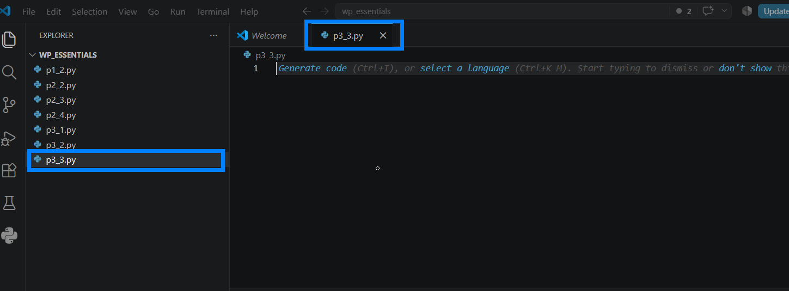

---

### Paso 2. Escribir el siguiente código

Agregar el siguiente programa.

```python
frase = input("Ingrese una frase: ")

print("Tu frase es:", frase)

posicion = int(input("¿Qué carácter desea consultar?: "))

print("El carácter en la posición", posicion, "es:", frase[posicion])
```

Guardar el archivo.


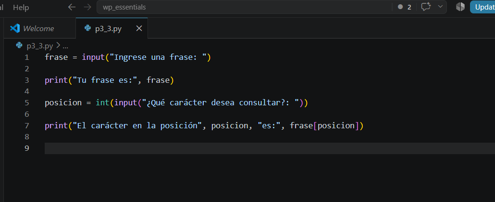


---

## Tarea 2. Ejecutar el programa

### Paso 1. Ejecutar el script

Ejecutar el programa utilizando el botón **Run Python File** o desde la terminal.

```bash
python p3_3.py
```

Cuando el programa lo solicite, escribir una frase.

Por ejemplo:

```text
Hola Mundo Python
```

Después ingresar una posición, por ejemplo:

```text
5
```

Observar el carácter que devuelve el programa.

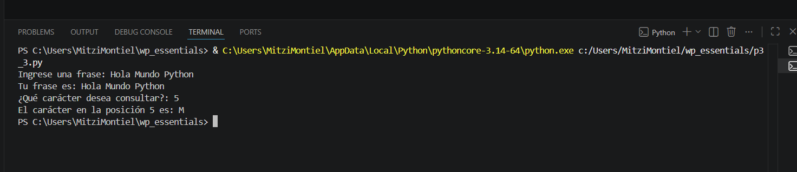

---

### Paso 2. Probar con diferentes posiciones

Ejecutar nuevamente el programa e ingresar otra frase.

Por ejemplo:

```text
Sigue al conejo blanco
```

Después consultar otra posición diferente.

Responder:

- ¿Qué carácter obtuvo?
- ¿Cambió el resultado al modificar la posición?


---

## Tarea 3. Experimentar con la indexación

Modificar únicamente el valor de la posición e intentar responder las siguientes preguntas.

1. ¿Qué ocurre si se consulta la posición **0**?

2. ¿Qué sucede si se consulta la última posición de la cadena?

3. ¿Qué ocurre si se escribe un número mayor que la longitud de la frase?

> **Nota:** Si el índice no existe, Python genera una excepción denominada **IndexError**, indicando que la posición solicitada está fuera del rango válido de la cadena.

---

## Tarea 4. Analizar los resultados

Responder las siguientes preguntas.

1. ¿Qué representa el índice de una cadena?

2. ¿En qué posición comienza la indexación en Python?

3. ¿Por qué fue necesario convertir la entrada del usuario utilizando `int()`?

4. ¿Qué ocurre si se intenta acceder a una posición inexistente?

---

# Validación

Verifique que realizó correctamente las siguientes actividades.

| Actividad | Completado |
|------------|------------|
| Creó el archivo `p3_3.py` | ☐ |
| Capturó una frase mediante `input()` | ☐ |
| Solicitó una posición al usuario | ☐ |
| Accedió a un carácter mediante indexación | ☐ |
| Probó diferentes posiciones | ☐ |
| Identificó el error al acceder a una posición inválida | ☐ |

---

# Resultado esperado

Al finalizar la práctica el programa deberá mostrar un carácter específico de la cadena, correspondiente a la posición indicada por el usuario.

Ejemplo:

```text
Ingrese una frase:
Hola Mundo Python

¿Qué carácter desea consultar?
5

El carácter en la posición 5 es: M
```

---

# Conclusión

Durante esta práctica aprendiste a utilizar la indexación de cadenas para acceder a caracteres específicos dentro de un texto. También comprobaste que la primera posición de una cadena es **0** y que acceder a una posición fuera de los límites genera un **IndexError**.

La indexación es uno de los conceptos fundamentales de Python y será utilizada constantemente al trabajar con cadenas, listas, tuplas y otras estructuras de datos.

---

# Conocimientos adquiridos

Al finalizar esta práctica aprendiste a:

- Acceder a caracteres mediante indexación.
- Utilizar el operador `[]`.
- Convertir datos con `int()`.
- Comprender que la indexación inicia en **0**.
- Identificar el error **IndexError** cuando se accede a una posición inexistente.

---

# Práctica 3.4. Corte de cadenas (Slicing)

## Objetivo de la práctica

Al finalizar esta práctica, serás capaz de:

- Utilizar la técnica de **slicing** para extraer subcadenas de una cadena de caracteres.
- Comprender cómo funcionan los índices de inicio y fin en un corte de cadenas.
- Construir programas que permitan al usuario obtener una parte específica de un texto.

---

# Objetivo visual

Durante esta práctica desarrollarás un programa que permitirá extraer una subcadena a partir de una frase y dos posiciones indicadas por el usuario.

```text
        Abrir Visual Studio Code
                   │
                   ▼
         Crear el archivo p3_4.py
                   │
                   ▼
      Capturar una frase
                   │
                   ▼
 Capturar posición inicial y final
                   │
                   ▼
      Aplicar slicing [inicio:fin]
                   │
                   ▼
      Mostrar la subcadena
                   │
                   ▼
      Analizar el resultado
```

---

## Duración aproximada

**8 minutos**

---

# Tabla de ayuda

| Recurso | Valor |
|---------|-------|
| Editor | Visual Studio Code |
| Lenguaje | Python 3 |
| Archivo | `p3_4.py` |
| Funciones utilizadas | `input()`, `print()`, `int()` |
| Operador utilizado | `[:]` (Slicing) |

---

# Instrucciones

## Tarea 1. Crear el programa

### Paso 1. Crear un nuevo archivo

Crear un archivo llamado:

```text
p3_4.py
```

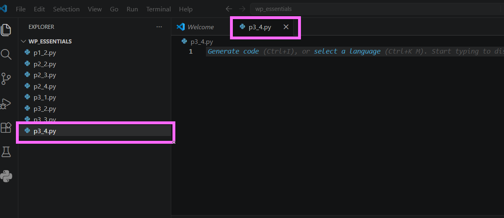

---

### Paso 2. Escribir el siguiente código

Agregar el siguiente programa.

```python
frase = input("Ingrese una frase: ")

print("Su frase es:", frase)

inicio = int(input("Ingrese la posición inicial: "))
fin = int(input("Ingrese la posición final: "))

subcadena = frase[inicio:fin]

print("La subcadena es:", "'" + subcadena + "'")
```

Guardar el archivo.

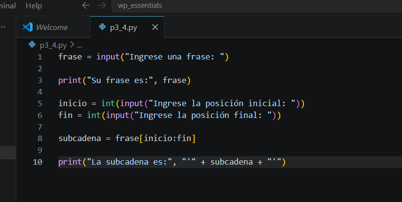

---

## Tarea 2. Ejecutar el programa

### Paso 1. Probar con una cadena numérica

Ejecutar el programa utilizando el botón **Run Python File** o mediante la terminal.

```bash
python p3_4.py
```

Ingresar la siguiente información.

```text
Frase:
1234567890

Posición inicial:
1

Posición final:
5
```

Observar el resultado.

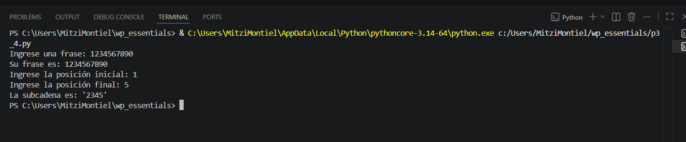

---

### Paso 2. Probar con una frase

Ejecutar nuevamente el programa.

Ingresar la siguiente información.

```text
Frase:
Sigue al conejo blanco

Posición inicial:
9

Posición final:
15
```

Observar la subcadena obtenida.

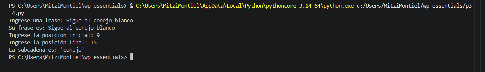


---

## Tarea 3. Experimentar con el slicing

Modificar únicamente los valores de inicio y fin para responder las siguientes preguntas.

1. ¿Qué ocurre si el índice inicial es **0**?

2. ¿Qué sucede si el índice final coincide con la longitud de la cadena?

3. ¿Qué ocurre si ambos índices son iguales?

4. ¿Qué sucede si el índice inicial es mayor que el índice final?

> **Nota:** En Python, el índice inicial se incluye en el resultado, mientras que el índice final **no se incluye**.

---

## Tarea 4. Analizar los resultados

Responder las siguientes preguntas.

1. ¿Cuál es la diferencia entre utilizar `frase[posicion]` y `frase[inicio:fin]`?

2. ¿Qué representa el índice inicial?

3. ¿Qué representa el índice final?

4. ¿Por qué el carácter ubicado en la posición final no aparece en la subcadena?

5. ¿Qué ventajas ofrece el uso de **slicing** al trabajar con cadenas de texto?

---

# Validación

Verifique que realizó correctamente las siguientes actividades.

| Actividad | Completado |
|------------|------------|
| Creó el archivo `p3_4.py` | ☐ |
| Capturó una frase | ☐ |
| Solicitó una posición inicial | ☐ |
| Solicitó una posición final | ☐ |
| Utilizó el operador de slicing `[:]` | ☐ |
| Extrajo correctamente una subcadena | ☐ |
| Respondió las preguntas de análisis | ☐ |

---

# Resultado esperado

Al finalizar la práctica el programa deberá permitir obtener una parte específica de una cadena utilizando una posición inicial y una posición final.

Ejemplo:

```text
Ingrese una frase:
1234567890

Ingrese la posición inicial:
1

Ingrese la posición final:
5

La subcadena es: '2345'
```

---

# Conclusión

Durante esta práctica aprendiste a utilizar el operador **slicing (`[:]`)** para extraer porciones de una cadena de caracteres. Comprobaste que el índice inicial sí forma parte de la subcadena, mientras que el índice final únicamente indica dónde termina el corte y no se incluye en el resultado.

El uso de slicing es una herramienta muy útil para manipular texto y será ampliamente utilizado en capítulos posteriores al trabajar con cadenas, listas y otras estructuras de datos.

---

# Conocimientos adquiridos

Al finalizar esta práctica aprendiste a:

- Utilizar el operador de slicing (`[:]`).
- Extraer subcadenas a partir de una posición inicial y final.
- Comprender que el índice final no forma parte del resultado.
- Diferenciar entre indexación y slicing.
- Manipular cadenas de caracteres de manera eficiente.